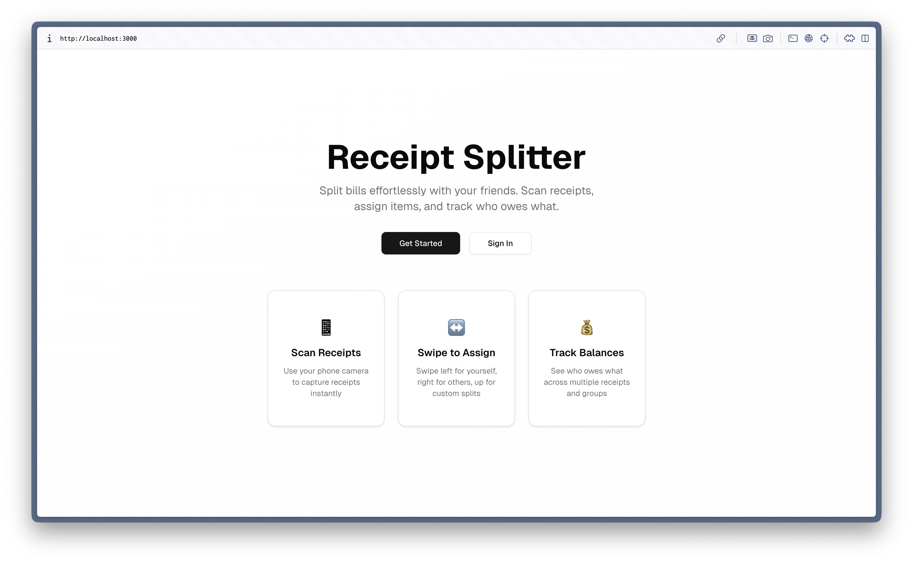
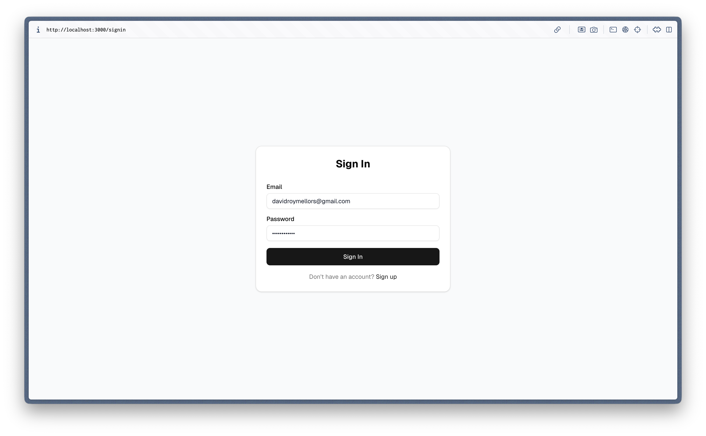
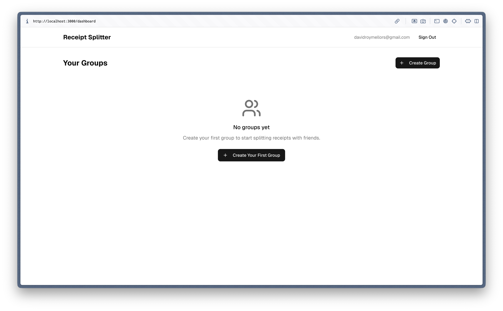
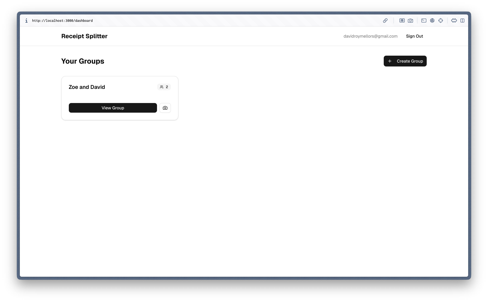
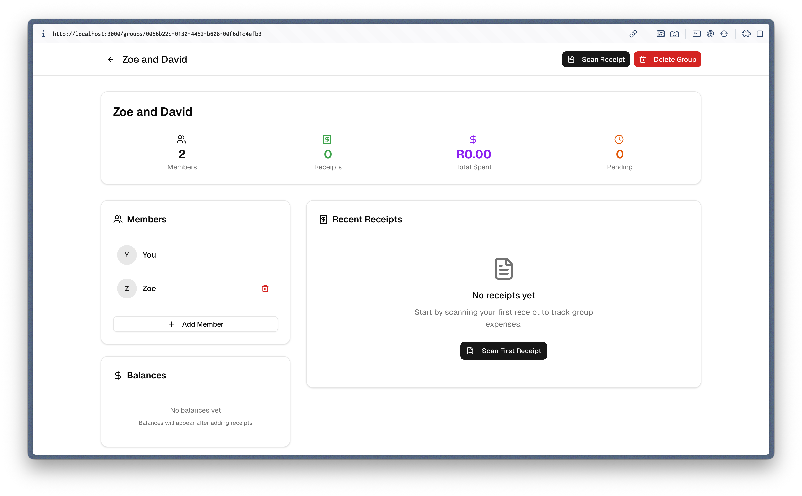
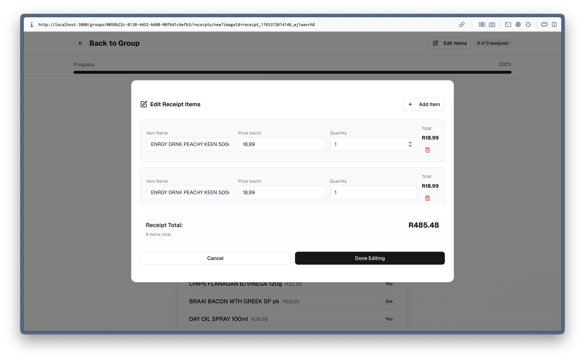
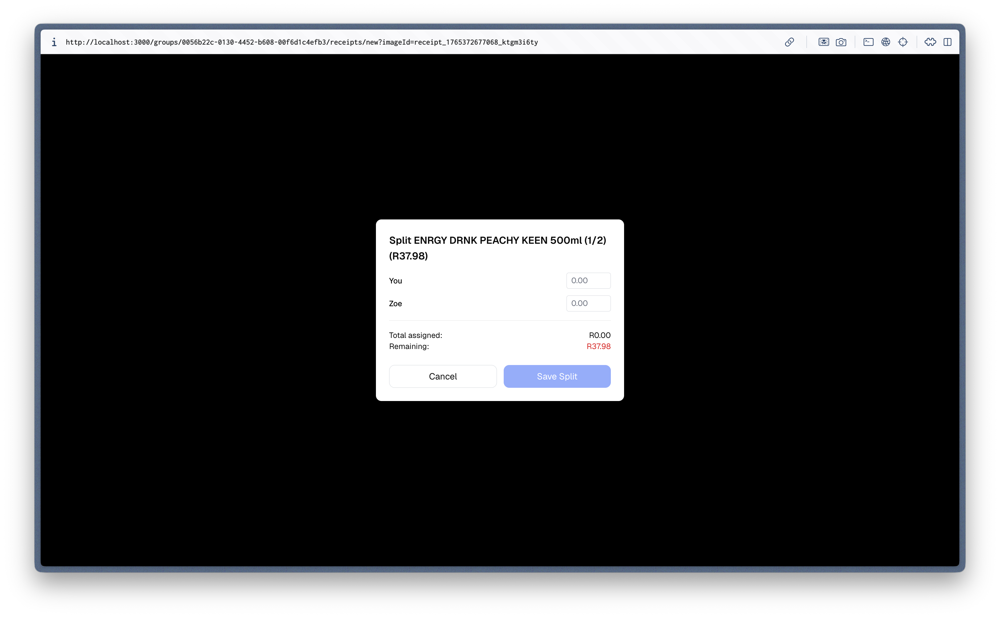
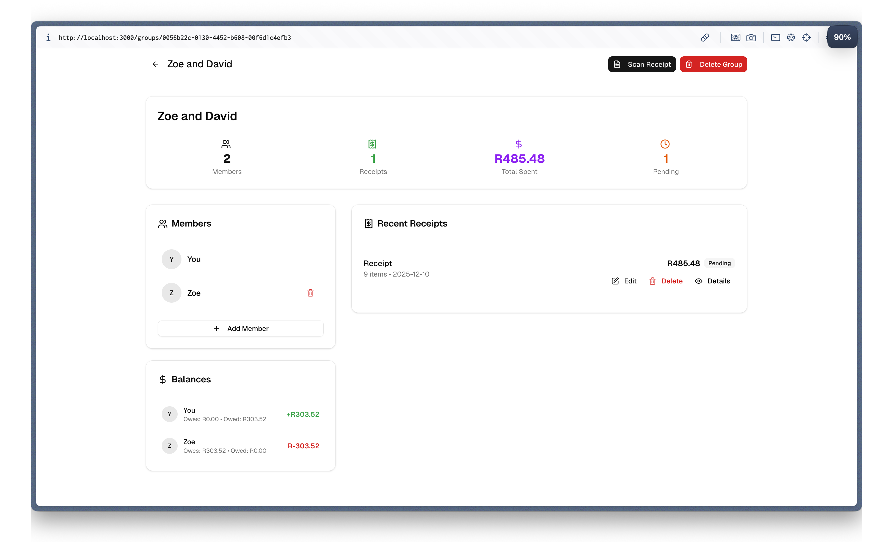
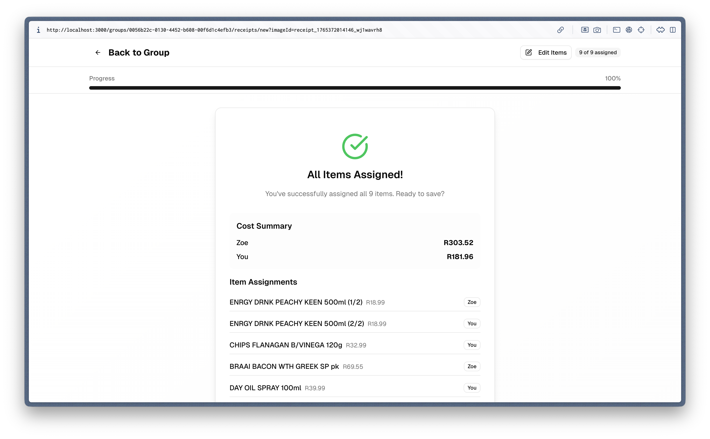
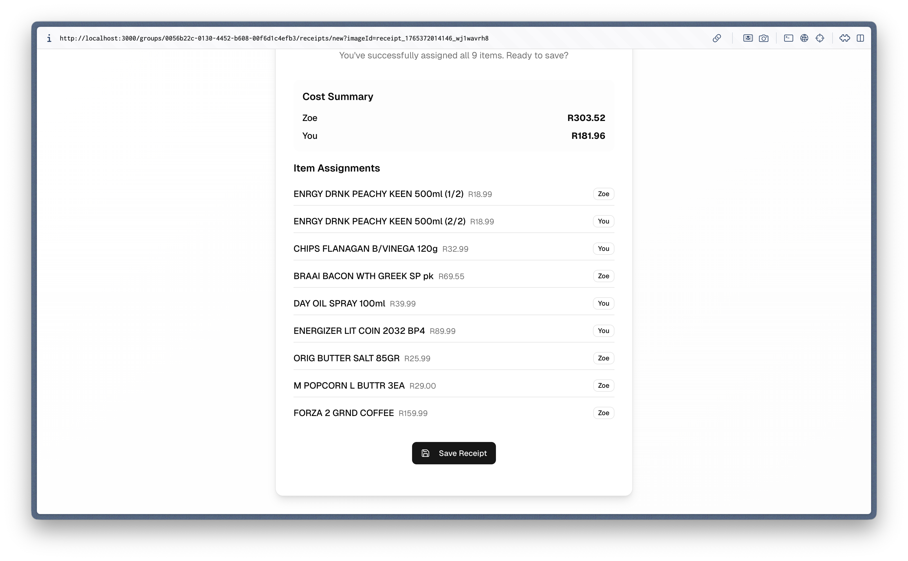

# Receipt Splitter

A modern web application for splitting bills and receipts among groups. Scan receipts with your phone camera, use AI to extract items, and assign expenses with intuitive swipe gestures.

## Features

- 📱 **Camera Receipt Scanning**: Capture receipts directly with your phone camera
- 🤖 **AI-Powered Parsing**: Uses OpenAI GPT-4 Vision to extract items and prices
- 👆 **Intuitive Swipe UI**: Swipe to assign items (left: yourself, right: others, up: custom, down: split)
- 💰 **Smart Balance Tracking**: Keep running totals across multiple receipts
- 👥 **Group Management**: Create groups and manage members
- 📊 **Payment Tracking**: Mark payments and settle balances
- 📱 **Mobile-First Design**: Optimized for mobile devices with smooth animations

## Screenshots

### Authentication Flow
<p float="left">
  
  
  
</p>

### Home & Groups
<p float="left">
  
  
  
  
</p>

### Receipt Scanning & AI Processing
<p float="left">
  
  
  
</p>

### Item Assignment
<p float="left">
  
  
</p>

### Summary & Results
<p float="left">
  
  
  
</p>

## Tech Stack

- **Frontend**: Next.js 14, React 19, TypeScript, Tailwind CSS
- **Animations**: Framer Motion
- **Camera**: React Webcam
- **Backend**: Next.js API routes
- **Database**: Supabase (PostgreSQL)
- **Authentication**: Supabase Auth
- **AI**: OpenAI GPT-4 Vision API
- **Deployment**: Vercel

## Getting Started

### Prerequisites

- Node.js 18+ and npm
- Supabase account
- OpenAI API account

### Installation

1. Clone the repository:
```bash
git clone https://github.com/davidrmellors/receipt-splitter.git
cd receipt-splitter
```

2. Install dependencies:
```bash
npm install
```

3. Set up environment variables:
Create a `.env.local` file in the root directory:
```env
# Supabase
NEXT_PUBLIC_SUPABASE_URL=your_supabase_project_url
NEXT_PUBLIC_SUPABASE_ANON_KEY=your_supabase_anon_key
SUPABASE_SERVICE_ROLE_KEY=your_supabase_service_role_key

# OpenAI
OPENAI_API_KEY=your_openai_api_key
```

4. Set up Supabase:
   - Create a new Supabase project
   - Run the migration script in `supabase/migrations/001_initial_schema.sql`
   - Configure authentication settings

5. Start the development server:
```bash
npm run dev
```

Open [http://localhost:3000](http://localhost:3000) in your browser.

## Usage

### Creating a Group

1. Sign up or log in to your account
2. Click "Create Group" on the dashboard
3. Add group name, description, and members
4. Start scanning receipts!

### Scanning Receipts

1. Open a group and click "Scan Receipt"
2. Allow camera permissions
3. Position the receipt within the frame
4. Take a photo - the AI will extract all items

### Assigning Items

Use intuitive swipe gestures on each item:
- **Swipe Left**: Assign to yourself
- **Swipe Right**: Assign to a group member
- **Swipe Up**: Create custom split
- **Swipe Down**: Split evenly among group

### Managing Payments

- View balances in the group summary
- Mark payments as completed
- Request payments from other members
- Track running balances across multiple receipts

## Project Structure

```
src/
├── app/                    # Next.js app router pages
│   ├── api/               # API routes
│   ├── dashboard/         # Dashboard page
│   ├── groups/           # Group management pages
│   ├── signin/           # Authentication pages
│   └── signup/
├── components/            # Reusable components
│   ├── auth/             # Authentication components
│   ├── camera/           # Camera capture components
│   └── receipt/          # Receipt-related components
├── lib/                  # Utility libraries
│   ├── supabase.ts      # Supabase client setup
│   └── openai.ts        # OpenAI integration
└── types/               # TypeScript type definitions
```

## Deployment

### Deploy to Vercel

1. Connect your repository to Vercel
2. Add environment variables in Vercel dashboard
3. Deploy automatically on push to main branch

### Environment Variables

Make sure to set these in your deployment environment:
- `NEXT_PUBLIC_SUPABASE_URL`
- `NEXT_PUBLIC_SUPABASE_ANON_KEY`
- `SUPABASE_SERVICE_ROLE_KEY`
- `OPENAI_API_KEY`

## Contributing

1. Fork the repository
2. Create a feature branch
3. Make your changes
4. Add tests if applicable
5. Submit a pull request

## License

This project is licensed under the MIT License.
